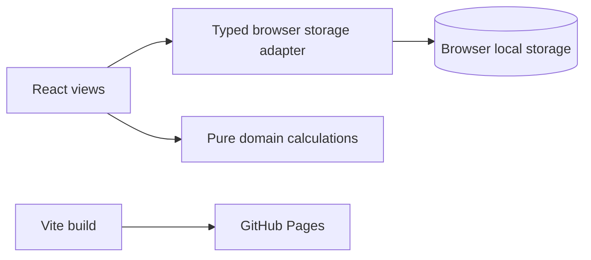

# Training Planner Developer Guide

## Runtime Architecture

Training Planner v2 is a local-first static React web application. Vite bundles the frontend and GitHub Pages serves the generated `dist/` files. There is no Electron process, server-side API, or runtime Node.js dependency.



`src/main.tsx` installs the adapter before React renders. Components use the typed `window.trainingPlanner` API and do not access browser storage directly.

## Source Layout

| Path | Responsibility |
| --- | --- |
| `src/App.tsx` | Application shell, navigation, initial state load, and theme application. |
| `src/views.tsx` | Dashboard, Planner, run logging, goals, and settings views. |
| `src/session-builder.tsx` | Reusable structured-session editor and Planner session panel. |
| `src/browser-api.ts` | Typed local persistence adapter, validation, state migration, and browser storage errors. |
| `src/domain.ts` | Pure calculations, formatting, and date utilities. |
| `src/types.ts` | Shared persisted entities and typed command payloads. |
| `src/styles.css` | Shared responsive visual system. |
| `src/domain.test.ts` | Domain calculation tests. |
| `.github/workflows/deploy-pages.yml` | Static GitHub Pages deployment workflow. |

## Persistence Contract

The browser adapter stores a versioned state envelope under `training-planner-state-v2`. It migrates the previous browser-preview key on first read. Each command reads state, validates its input, produces a complete next snapshot, and writes that snapshot in one `localStorage` operation.

Browser storage is tied to the browser profile and deployed site origin. Clearing site data, using a different browser, or using another GitHub Pages origin starts a separate local data set. The v1 Electron SQLite database cannot be imported automatically by a static browser application; a separate desktop export/import tool is required for that migration.

## Development

Requirements: Node.js 22 or later.

```powershell
npm.cmd install
npm.cmd run dev
npm.cmd run typecheck
npm.cmd test
npm.cmd run build
```

`npm run dev` starts the Vite web server. `npm run build` creates the static production artifact in `dist/`.

## GitHub Pages Deployment

Enable **GitHub Actions** as the repository's Pages source. On a push to `main`, the deployment workflow installs locked dependencies, builds with `VITE_BASE_PATH` set to `/<repository-name>/`, uploads `dist/`, and deploys it.

For a custom domain or a non-Pages host, build with the appropriate base path:

```powershell
$env:VITE_BASE_PATH = "/"
npm.cmd run build
```

## Change Guidelines

1. Add a typed command to `src/types.ts` when a new persistence operation is needed.
2. Implement validation and the atomic state update in `src/browser-api.ts`.
3. Keep shared calculations in `src/domain.ts` and add focused Vitest coverage.
4. Update React views to use the typed command rather than browser APIs directly.
5. Run typecheck, tests, and a Vite production build before deployment.
